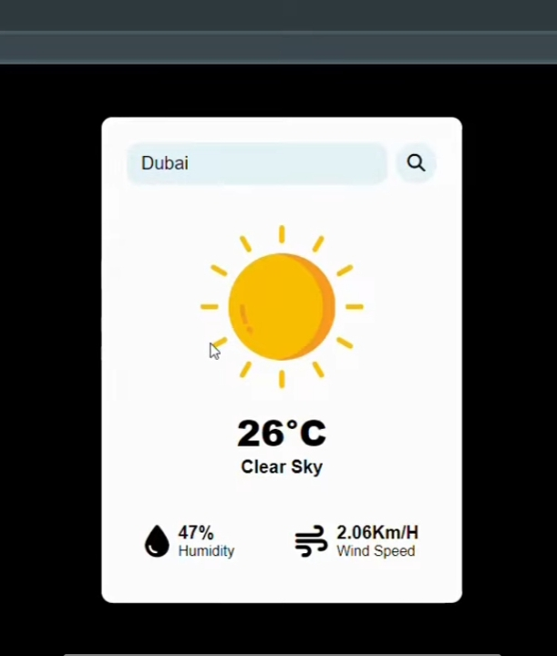
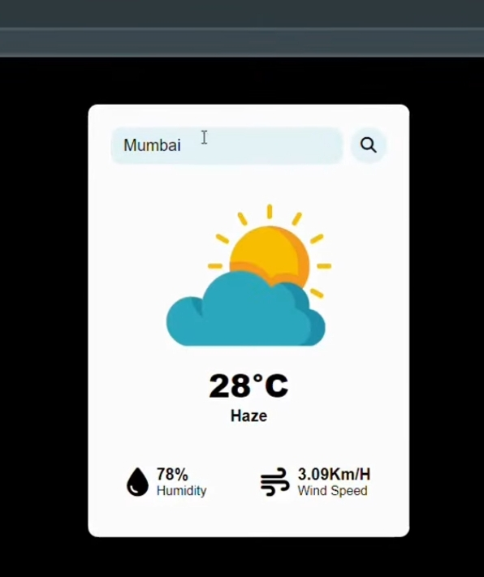
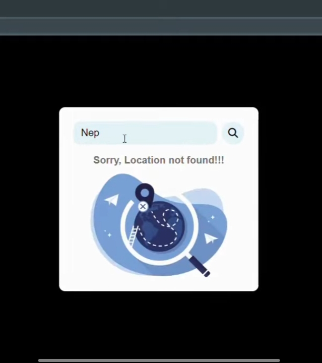

# Weather App

Welcome to the Weather App repository! This simple application allows users to retrieve weather information for a specified location.

## Features

- **Location-based Weather**: Users can input a location (city, zip code, etc.) and get real-time weather information.
- **Current Conditions**: Provides current weather conditions such as temperature, humidity, wind speed, and more.
- **Forecast**: Offers a 7-day weather forecast for the specified location.
- **Responsive Design**: The app is designed to be responsive and work across various devices.

## Technologies Used

- **Frontend**: HTML, CSS, JavaScript
- **APIs**: OpenWeatherMap API (for weather data retrieval)

## Screenshots







## Installation

1. Clone the repository:

```bash
git clone https://github.com/yourusername/weather-app.git
